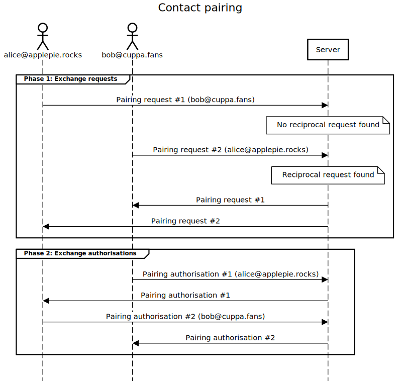

# Contact pairing

Contact pairing is a two-phase process due to Awala's E2E encryption and pre-authorisation requirements, and this server plays the role of a broker as follows:

1. The two parties exchange [_pairing requests_](#contact-pairing-request). The order in which requests are received is irrelevant, as the server will wait until both have been received before exchanging them.
2. The two parties exchange [_pairing authorisations_](#contact-pairing-authorisation). The order in which authorisations are received is irrelevant, as the server will forward them as they are received.

The diagram below illustrates the process above:



The two parties will then be able to communicate with each other using the Awala protocol, without further intervention from this server.

## Messages

### Contact pairing request

This message signifies a Letro user's intention to pair with another user.

- Recipient: Both server and user agent.
- Content type: `application/vnd.relaycorp.letro.contact-pairing.request`.
- Content: A DER-serialised [VeraId `SignatureBundle`](https://veraid.net/specs/v1) encapsulating a `ContactPairingRequest` structure (see below).

The ASN.1 `ContactPairingRequest` structure is defined as follows:

```asn1
ContactPairingRequest ::= SEQUENCE {
  requesterAwalaEndpointPublicKey [0] SubjectPublicKeyInfo -- From the X.509 spec
  prospectiveContactVeraid        [1] UTF8String           -- E.g., "maria@example.com"
}
```

The following MUST also be true, or else the pairing request will be rejected and a [`ContactPairingFailure` message](#contact-pairing-failure) will be sent to the requester:

- `requesterAwalaEndpointPublicKey` corresponds to the Awala endpoint that sent the service message.
- `prospectiveContactVeraid` is a well-formed VeraId identifier for a user (e.g., `maria@example.com`), not a bot (e.g., `example.com`).

### Contact pairing authorisation

This message encapsulates the Awala _connection parameters_ whereby a Letro user (the granter) authorises another user (the grantee) to message them.

- Recipient: Both server and user agent.
- Content type: `application/vnd.relaycorp.letro.pairing-auth`.
- Content: An Awala endpoint's connection parameters binary. For example, the output from `FirstPartyEndpoint.authorizeIndefinitely()` in the Awala Android SDK.

### Contact pairing failure

This message signifies that a pairing request has failed.

- Recipient: User agent.
- Content type: `application/vnd.relaycorp.letro.contact-pairing.failure`.
- Content: A DER-serialised `ContactPairingFailure` structure (see below).

The ASN.1 `ContactPairingFailure` structure is defined as follows:

```asn1
ContactPairingFailure :: INTEGER {
  REQUESTER_AWALA_KEY_MISMATCH(0)
}

ContactPairingFailure ::= SEQUENCE {
  prospectiveContactVeraid [0] UTF8String,  -- E.g., "maria@example.com"
  reason                   [1] ContactPairingFailure
}
```

Where the `ContactPairingFailure` can be one of the following:

- `REQUESTER_AWALA_KEY_MISMATCH`: The requester's Awala endpoint public key does not correspond to the one that sent the service message.

## Security considerations

Since pairing requests are signed with [VeraId](https://veraid.net), it's not possible for the server to forge or tamper with them. Worst case scenario, if the server were compromised, it could only prevent pairing requests from being forwarded.

## Data persistence

Contact pairing requests are stored for up to 90 days or until they are matched, whichever comes first.
